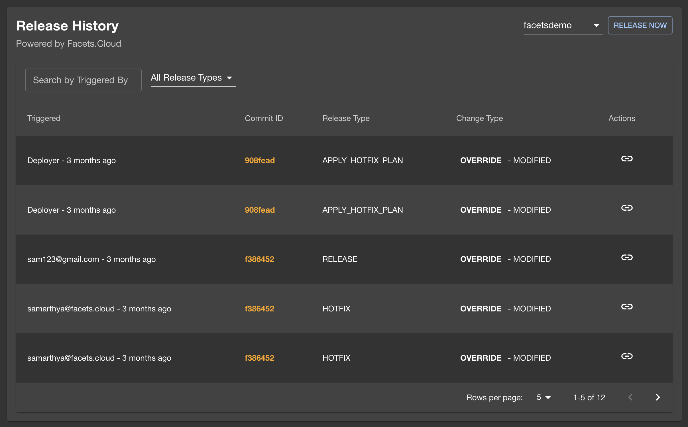

# Facets.cloud Backstage plugins

This repository contains [Backstage](https://backstage.io/) plugins to interact with the [Facets.cloud Platform](https://facets.cloud) from your Backstage Portal.

* [facets-cloud](./backstage-plugins/plugins/facets-cloud) Show environments, release history and Terraform outputs for resources deployed by Facets.cloud.
* [facets-cloud-backend](./backstage-plugins/plugins/facets-cloud-backend/) Backend API route for facets-cloud plugin.

## Development

To start the app, from backstage-plugins folder, run:

```sh
yarn install
yarn dev
```

Execute the tests using:

```sh
yarn test
```

## Components Available
The following components are available for use on the entity page in Backstage.

### Environment Overview

This component provides an overview of all environments currently deployed in Facets for a particular resource.


### Release History

This component displays the release history of a resource in a selected environment. You can also trigger a new release by clicking the “Release Now” button.





### Terraform Outputs

This component provides an overview of all Terraform outputs for environments currently deployed in Facets for a particular resource.


